# MultiLLM.Core

A reusable .NET library for multi-provider Large Language Model (LLM) chat completions supporting OpenAI, Anthropic, HuggingFace, Google, Grok, and Azure.

## 🏗️ Architecture Overview


## 📦 Solution Structure

```mermaid
graph LR
    Solution[MultiLLM.sln]

    Solution --> CoreProject[MultiLLM.Core]
    Solution --> DemoProject[MultiLLM.Demo]
    Solution --> TestProject[MultiLLM.Core.Tests]

    CoreProject --> CoreLib[📚 Core Library]
    DemoProject --> DemoApp[🚀 Demo Console App]
    TestProject --> TestSuite[🧪 Unit Tests]
```



## 🔧 Core Components

### Interfaces


### Models


## 🚀 Service Flow


## 🔌 Provider Support

```mermaid
graph LR
    Factory[ChatCompletionServiceFactory]

    Factory --> OpenAI[OpenAI ✅]
    Factory --> Anthropic[Anthropic 🚧]
    Factory --> HuggingFace[HuggingFace 🚧]
    Factory --> Google[Google 🚧]
    Factory --> Grok[Grok 🚧]
    Factory --> Azure[Azure 🚧]

    subgraph Legend
        Implemented[✅ Implemented]
        Planned[🚧 Planned]
    end
```



## 🧪 Testing Strategy


## 🛠️ Getting Started

### Installation

```bash
# Clone the repository
git clone <repository-url>

# Restore dependencies
dotnet restore

# Build the solution
dotnet build
```

### Running the Demo

```bash
# Set OpenAI API key (optional - demo works without it)
set OPENAI_API_KEY=your-api-key-here

# Run the demo
dotnet run --project MultiLLM.Demo
```

### Running Tests

```bash
# Run all tests
dotnet test

# Run tests with coverage
dotnet test --collect:"XPlat Code Coverage"
```

## 📋 Configuration Flow


## 🔑 Environment Variables

| Variable | Description | Required |
|----------|-------------|----------|
| `OPENAI_API_KEY` | OpenAI API key for live testing | Optional |
| *Future providers* | Additional API keys as providers are added | Optional |

## 📚 Usage Example

```csharp
// Setup dependency injection
var services = new ServiceCollection();
services.AddHttpClient();
services.AddSingleton<OpenAIChatCompletionService>();
services.AddSingleton<IChatCompletionServiceFactory, ChatCompletionServiceFactory>();

var serviceProvider = services.BuildServiceProvider();

// Get service and make a chat completion
var factory = serviceProvider.GetRequiredService<IChatCompletionServiceFactory>();
var openAiService = factory.GetService("openai");

var model = new ModelDefinition { Provider = "openai", ModelId = "gpt-3.5-turbo" };
var messages = new[] { new ChatMessage(ChatRole.User, "Hello!") };

var response = await openAiService.CompleteAsync(model, messages, apiKey, CancellationToken.None);
```

## 🤝 Contributing

1. Fork the repository
2. Create a feature branch
3. Add tests for new functionality
4. Ensure all tests pass
5. Submit a pull request

## 📄 License

MIT License - see LICENSE file for details.