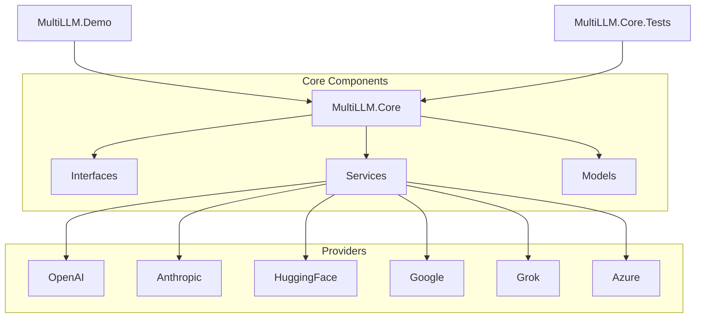
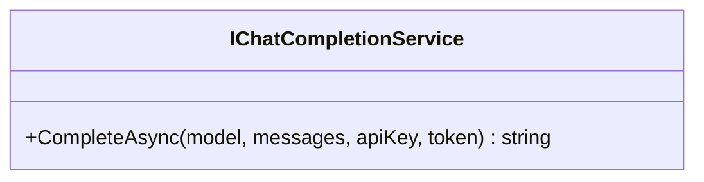

# MultiLLM.Core Architecture

## Architecture overview

```mermaid
graph TB
    Demo[MultiLLM.Demo]
    Core[MultiLLM.Core]
    Tests[MultiLLM.Core.Tests]
    Demo --> Core
    Tests --> Core
    subgraph "Core Components"
        Core --> Interfaces[Interfaces]
        Core --> Services[Services]
        Core --> Models[Models]
    end
    subgraph "Providers"
        OpenAI[OpenAI]
        Anthropic[Anthropic]
        HF[HuggingFace]
        Google[Google]
        Grok[Grok]
        Azure[Azure]
    end
    Services --> OpenAI
    Services --> Anthropic
    Services --> HF
    Services --> Google
    Services --> Grok
    Services --> Azure
```

## Interface

```mermaid
classDiagram
    class IChatCompletionService {
        +CompleteAsync(model, messages, apiKey, token) string
    }
```
